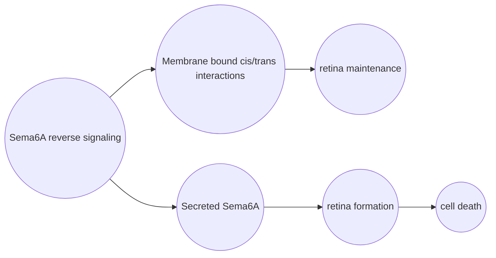

# header 1

## header 2

### header 3

#### header 4

##### header 5

###### header 6

Unordered lists: 

* item 1
  * item 1a
* item 2
  * item 2a

ordered lists: 

1. item 1
2. item 2

Manual line break with  
2 spaces 

Links: [Here is my Github website](https://carolinedumas.github.io/DumasBiol381/)

Images: [here is a picture of my dog](DumasBiol381/Maverick.jpeg)

block quotes: 
> Once upton a time 
> blah blah blah 

plain code blocks: `this text is plain`

R code blocks: 
```{r}
x <-3
y <-4
```

R code in line: `r x<-4`

in line LaTeX equation: $ y = mx + b $

centered LaTeX equation:
$$
y = mx +b
$$


horizontal line: 

---

simple table: 
First Header  | Second Header
------------- | -------------
Content Cell  | Content Cell
Content Cell  | Content Cell

==highlight== 





