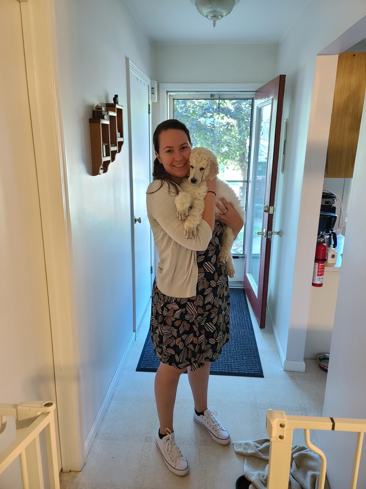
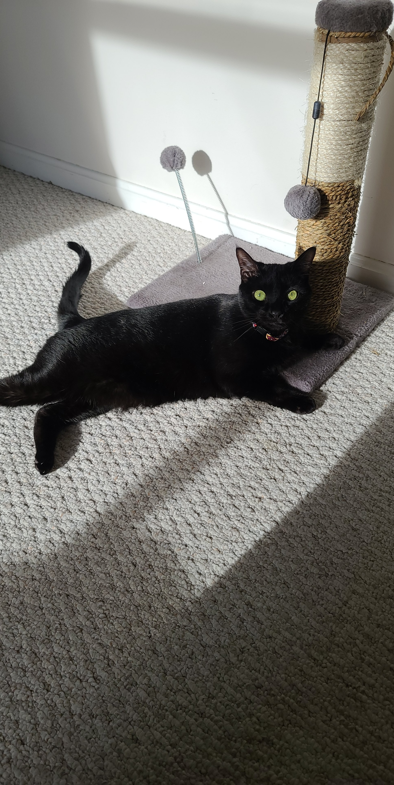
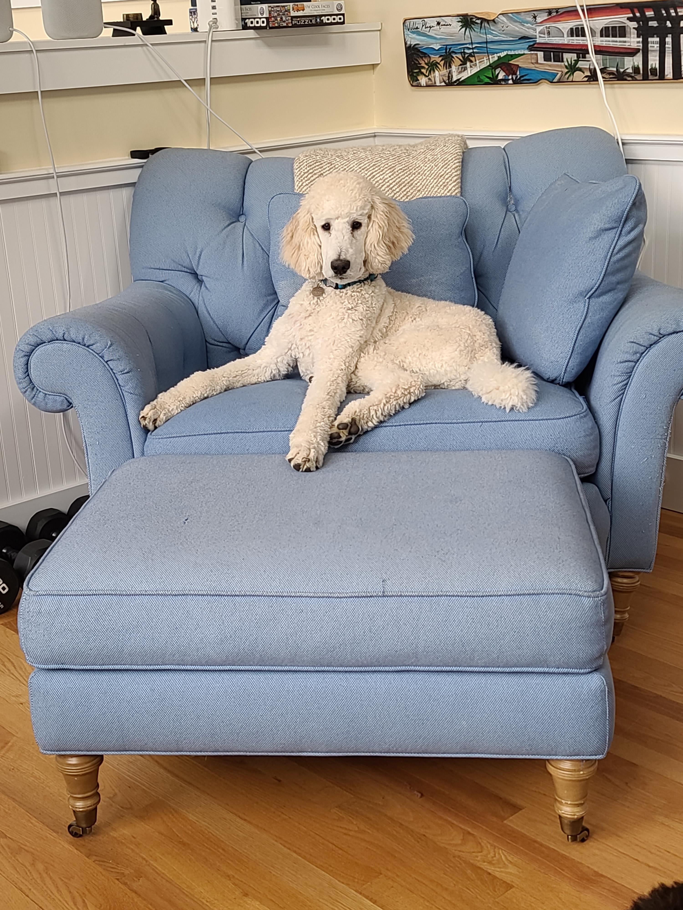

  

*This is my kitty, Lucy, and my puppy, Maverick!*

#### Fun Fact
I kissed the Blarney Stone in Ireland when I was 12 years old. The story is that if you kiss the Blarney stone you will get the gift of Gab. I definitely got the gift of Gab! 

#### Homework Assignments 

#### Week 1: nothing due 

#### Week 2: [create webpage instructions](https://gotellilab.github.io/Bio381/Homeworks/Homework02_S2021.html); [Homework 2](HW2.html)

#### Week 3: [Problem set website](https://gotellilab.github.io/Bio381/Homeworks/Homework03_S2021.html); [regular expressions homework answers](HW3.html)

#### Week 4: [instructions link](https://gotellilab.github.io/Bio381/Homeworks/Homework04_S2021.html); [Typora answers](Homework 4/Homework4Typora.html) and [letter Sample](Homework 4/SampleLetter.pdf) and [Slides Sample Beamer](Homework 4/SampleSlides.pdf)

#### Week 5: [Vector problem answers](HW5.html)

#### Week 6: [Matrices, lists and data frames](HW6.html)

#### Week 7: [Simulating and Fitting Data Distributions](HW7.html)

#### Week 9: [Creating Fake data sets to explore hypothesis](HW8.html)

#### Week 10: [stuctured programming of week 9 homework](HW9.html)

#### Week 11: [For loops and randomization tests](HW10.html)

